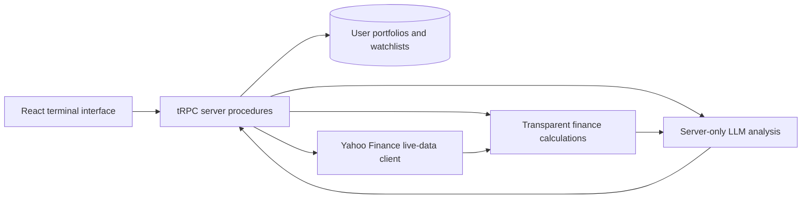

# AlphaSense AI MVP Architecture

## Product Boundary

AlphaSense AI is a **research and portfolio-analysis application**, not an automated trading or investment-advisory service. It records user-entered transactions, retrieves current market information at request time, calculates transparent portfolio analytics, and presents LLM-produced research summaries that remain traceable to the data snapshot supplied to the model. The interface will prominently disclose the retrieval time, provider, calculation assumptions, and that the output is for informational research only.

## Data-Integrity Policy

The application must not seed, fabricate, estimate, or label static values as market data. Every displayed price, OHLCV observation, company statement line, dividend, earnings date, article, fund attribute, and computed output is either: (a) returned by the live provider; (b) directly calculated from returned data; or (c) entered by the authenticated user. Every server response carries a `source`, `asOf`, and `dataStatus` field so stale, unavailable, or partial data is distinguishable from retrieved data.

| Data domain | MVP source and method | Display contract |
| --- | --- | --- |
| Quotes, price history, and OHLCV | Server-side Yahoo Finance public chart endpoint | Symbol, exchange/currency where supplied, provider time, and retrieval time are retained.
| Company statements and ratios | Server-side Yahoo Finance fundamentals time-series endpoint | Scores calculate only from retrieved income-statement, balance-sheet, and cash-flow values. Missing inputs reduce coverage; they never receive invented substitutes.
| News and earnings dates | Server-side Yahoo Finance search/news endpoint and Nasdaq public earnings calendar | Article/provider metadata, publication time, and exact three-way sentiment label are shown.
| Mutual-fund prices and risk metrics | Actual fund history from the provider, with metrics calculated from valid return observations | Sharpe, Sortino, Alpha, Beta, and maximum drawdown declare their window, benchmark, and coverage. Missing source fund profile fields are explicitly unavailable.
| Portfolio transactions | Authenticated user input persisted in the application database | Inputs are clearly marked as user supplied; current valuations use the live quote snapshot.
| LLM analysis and recommendations | Server-side LLM receives a bounded market-context packet generated from the above services | Response names the symbol, snapshot time, factual inputs, assumptions, and uncertainty. It may not assert data the packet does not contain.

## Runtime Topology

The React interface consumes typed tRPC procedures from one Express process. The server calls the public-data provider and the server-only LLM helper, derives calculations, and persists only user account data and user-requested analysis records in the database. This keeps the provider requests and LLM credentials out of the browser and remains compatible with short-lived, autoscaled application instances.

## MVP Acceptance Criteria

The completed app will make authenticated portfolio data persistent, refresh live market data only from the configured provider, and visibly distinguish provider data from calculated values. Prediction views will expose all four requested horizons—**1d, 7d, 30d, and 90d**—while describing their methods and uncertainty rather than presenting an invented certainty. Company intelligence scores will report the retrieved fundamental inputs and score coverage. News sentiment will validate to exactly **Positive**, **Negative**, or **Neutral**. The mutual-fund module will calculate its required risk metrics from real fund price histories and will only display fee, allocation, or holding information if the provider returns it.
